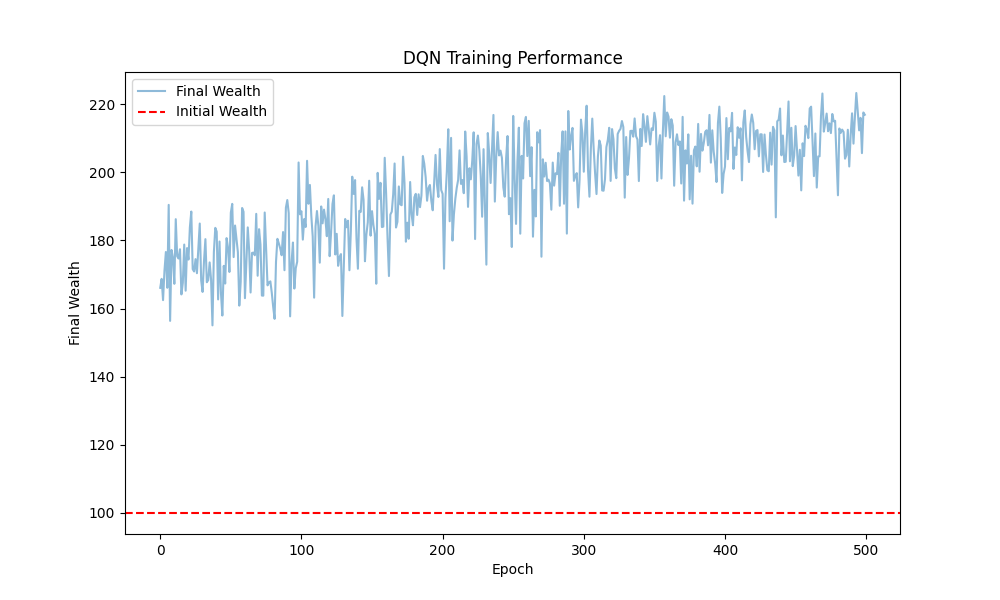
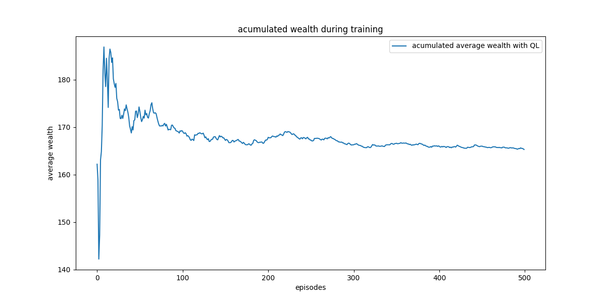

# Asset Allocation Assignment for Reinforcement Learning
HKUST MSBD6000M course project for the Asset Allocation in Reinforcement Learning


## Introduction
This project implements a discrete-time asset allocation strategy using Temporal Difference (TD) learning methods, specifically TD Q-learning and DQN algorithms. The problem involves optimizing investment decisions between risky and risk-free assets over a fixed time horizon of T=10 periods. The **objective** of the project is to find the optimal policy, which describe how much money(action) you 
should invest in the risky asset under different time & total wealth(states).


In our model, the risky asset follows a simple binary return process where:
- With probability p, the return is a (positive return)
- With probability 1-p, the return is a (negative return)


The environment is structured as a Markov Decision Process (MDP) where:
- States represent the current wealth level
- Actions determine the proportion of wealth allocated to the risky asset
- Rewards are calculated using a CARA (Constant Absolute Risk Aversion) utility function
- The risk-free asset provides a fixed return

We implemented two TD learning approaches:

1. **TD DQN (On-Policy Learning)**: Utilizes a neural network to approximate Q-values, updating them by minimizing the difference between the predicted Q-values and the target Q-values derived from the maximum Q-value of the next state. 

2. **TD Q-Learning (Off-Policy Learning)**: Updates Q-values using the maximum Q-value of the next state, potentially leading to more optimal solutions but with higher variance.

****


## **Env Setting**

Considering the practical constraints of asset allocation problems, we designed our environment with the following key assumptions and settings:

1. **State Space**
   - The state is defined by the current wealth level
   - Wealth values are rounded to 3 decimal places for discretization
   - Initial wealth is set to 100 units

2. **Action Space**
   - Actions represent the proportion of wealth allocated to risky assets
   - Action values range from 0 to 1 (continuous)
   - Discretized into 11 possible actions (0.0, 0.1, ..., 1.0) for computational efficiency

3. **Asset Returns**
   - Risky Asset:
     - High return: +20% with probability 0.6
     - Low return: -10% with probability 0.4
   - Risk-free Asset:
     - Fixed return: 3% (constant)

4. **Investment Horizon**
   - Fixed time horizon of 10 periods
   - Each episode represents a complete investment cycle

5. **Reward Function**
   - Based on Constant Absolute Risk Aversion (CARA) utility function
   - $U(W) = -e^{-aW}$
   - Risk aversion coefficient (a) = 1.0

6. **Learning Parameters**
   - Learning rate: 0.005
   - Discount factor: 0.99
   - Exploration rate (ε-greedy): 0.1

The environment is implemented as a custom Gymnasium environment class, inheriting from `gym.Env`. This allows for standardized interaction between the agent and environment while maintaining the flexibility to incorporate domain-specific features of the asset allocation problem.

## Getting Started

#### Q-Learning

```shell
python AssetAllocation_QL.py
```

#### DQN

```shell
python AssetAllocation_DQN.py
```

* The final asset allocation policies are recorded in `results_QL.txt` and `results_DQN.txt`. Partial of them are shown below.

  ```
  State: 100	Action:1.0
  State: 100.0	Action:1.0
  State: 110.0	Action:1.0
  State: 120.0	Action:1.0
  State: 130.0	Action:0.8
  State: 140.0	Action:0.8
  State: 150.0	Action:0.8
  State: 160.0	Action:0.9
  State: 180.0	Action:0.8
  State: 190.0	Action:1.0
  ```

* The performances of two algorithms are shown in  `training_results_QL.png` and `training_results_DQN.png`.

<center class="half">
	
</center>
