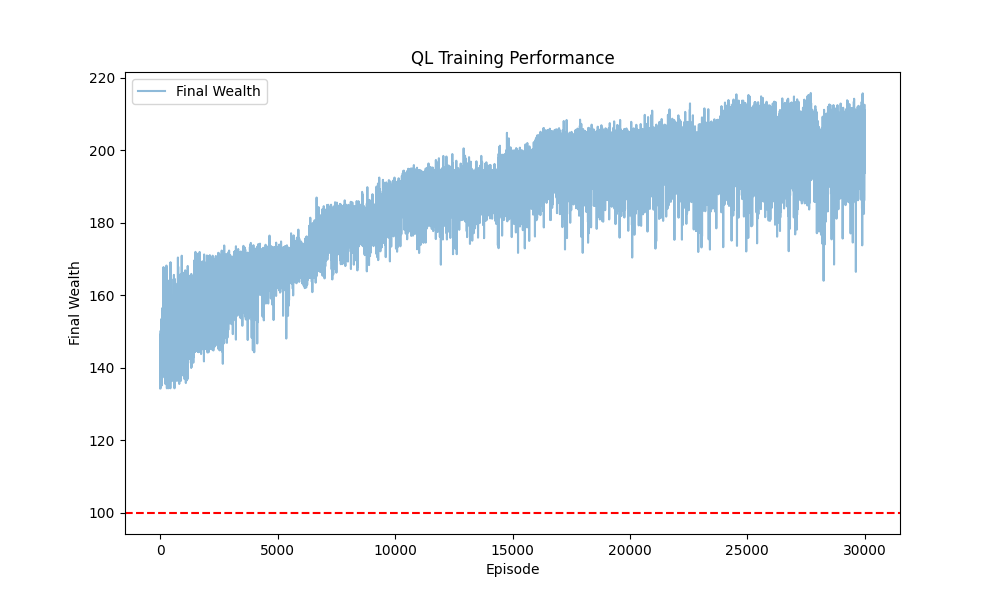

# Asset Allocation Assignment for Reinforcement Learning
HKUST MSBD6000M course project for the Asset Allocation in Reinforcement Learning

## Introduction
This project implements a discrete-time asset allocation strategy using Temporal Difference (TD) learning methods, specifically TD SARSA and Q-learning algorithms. The problem involves optimizing investment decisions between risky and risk-free assets over a fixed time horizon of T=10 periods. The **objective** of the project is to find the optimal policy, which describe how much money(action) you 
should invest in the risky asset under different time & total wealth(states).

In our model, the risky asset follows a simple binary return process where:
- With probability p, the return is a (positive return)
- With probability 1-p, the return is a (negative return)

The environment is structured as a Markov Decision Process (MDP) where:
- States represent the current wealth level
- Actions determine the proportion of wealth allocated to the risky asset
- Rewards are calculated using a CARA (Constant Absolute Risk Aversion) utility function
- The risk-free asset provides a fixed return

We implemented two TD learning approaches:

1. **TD SARSA (On-Policy Learning)**: Updates Q-values using the action selected by the current policy, making it more conservative but potentially more stable.

2. **TD Q-Learning (Off-Policy Learning)**: Updates Q-values using the maximum Q-value of the next state, potentially leading to more optimal solutions but with higher variance.

The key advantage of using TD methods for this problem is their ability to learn from each interaction without requiring complete episodes, making them more efficient than traditional Monte Carlo methods. Additionally, these methods can handle the continuous state space (wealth levels) through discretization while maintaining reasonable computational efficiency.

****

## **Mathematical Derivation**

While the textbook (Rao and Jelvis, section 8.4) assumes normally distributed returns for the risky asset, our implementation considers a discrete binary distribution. This necessitates a modification of the Q-function derivation. Below is our adapted mathematical reasoning:

### Asset Characteristics

Consider a financial model with two types of assets:

1. Risky Assets:
   - Outcome \[Y_t = a\] with probability \[p\]  
   - Outcome \[Y_t = b\] with probability \[1-p\]  

2. Riskless Asset:
   - Outcome \[Y_t = r\] (a constant value)

3. Model Parameters:
    - \[X_t\]: Percentage of assets allocated to risky assets at time \[t\]
    - \[W_t\]: Wealth at time \[t\]
    - Allocation to riskless assets: \[W_t - X_t\]
    - Discount factor: \[\gamma\] determine the current value of future wealth

4. Utility Function

We employ the Constant Absolute Risk Aversion (CARA) utility function as the reward function:

\[U(W) = \frac{1 - e^{-aW}}{a} \tag{1}\]

Where:
- \[a\] represents the coefficient of risk aversion
- \[e\] is the mathematical constant (Euler's number)

The CARA utility function provides a mathematical representation of an investor's risk preferences, allowing for quantitative analysis of portfolio decisions under uncertainty.

5. Target function:
\[\max E[\gamma^{T-t}\cdot \frac{1 - e^{-\alpha W_T}}{\alpha}|(t, W_t)] \tag{2}\]
also can be written as:
\[\max E[ \frac{- e^{-\alpha W_T}}{\alpha}|(t, W_t)] \tag{3}\]

6. Wealth Dynamics:
The evolution of wealth from time t to t+1 can be expressed as:

\[W_{t+1} = X_t(1+Y_t) + (W_t-X_t)(1+r) \tag{4}\]
\[= X_t(Y_t - r) + W_t(1 + r) \tag{5}\]

Value Function at time \( t \) (for all \( t = 0, 1, \dots, T - 1 \)) for a given policy \( \pi = (\pi_0, \pi_1, \dots, \pi_{T-1}) \) as:
\[ V_{\pi}(W_t) = \mathbb{E}_T\left[ -e^{-\alpha W_T} \mid (t, W_t) \right] \]

Optimal Value Function at time \( t \) (for all \( t = 0, 1, \dots, T - 1 \)) as:
\[ V^{*}(W_t) = \max_{\pi} V_{\pi}(W_t) = \max_{\pi} \mathbb{E}_T\left[ -e^{-\alpha W_T} \mid (t, W_t) \right] \]

The Action-Value Function \( Q_{\pi}(s, a) \) is a fundamental concept in reinforcement learning, used to evaluate the expected cumulative reward of taking action \( a \) in state \( s \) under policy \( \pi \). Its mathematical definition followed by Bellman Optimality Equation:
\[
V_{t}^{*}(W_{t}) = \max Q_{t}^{*}(W_{t}, X_{t}) = \max \left\{ \mathbb{E}_{Y_{t} }\left[ V_{t+1}^{*}(W_{t+1}) \right] \right\}
\]  
\[
V_{T-1}^{*}(W_{T-1}) = \max Q_{T-1}^{*}(W_{T-1}, X_{T-1}) = \max \left\{ \mathbb{E}_{Y_{T-1} }\left[ \frac{- e^{-\alpha W_T}}{\alpha} \right] \right\} \tag{6}
\]  

And make a guess for the functional form of the Optimal Value Function as:
\[V_t^*(W_t)=-b_t\cdot e^{-c_t\cdot W_t} \tag{7}\]

So that Optimal Value Function can be written as:
\[V_{t}^{*}(W_{t})=\max_{x_{t}}\{\mathbb{E}_{Y_{t}}[-b_{t+1}\cdot e^{-c_{t+1}\cdot W_{t+1}}]\}\]
Using Equation 4, this can be written as:
\[V_{t}^{*}(W_{t})=\max_{x_{t}}\{\mathbb{E}_{Y_{t}}[-b_{t+1}\cdot e^{-c_{t+1}\cdot(x_{t}\cdot(Y_{t}-r)+W_{t}\cdot(1+r))}]\} \tag{8}\]

Using distribution of Y_t, we can get the optimal value function as:
\[V_t^{*}(W_t) =   \max_{x_t} \left \{ -b_{t+1} \cdot e^{-C_{t+1}(1+r)W_t}\cdot [pe^{-C_{t+1}X_t(a-r)}+(1-p)e^{-C_{t+1}X_t(b-r)}]\right \}  \tag{9}\]
\[Q^{*}(W_t, X_t) =    -b_{t+1} \cdot e^{-C_{t+1}(1+r)W_t}\cdot [pe^{-C_{t+1}X_t(a-r)}+(1-p)e^{-C_{t+1}X_t(b-r)}]  \tag{10}\]

7. Get the Q-value function:
Since the right-hand-side of Bellman Optimality Equation involves the max operation over Xt, we can say that the partial derivative of the term inside the max operation with respect to Xt is 0.
\[
\frac{\partial}{\partial X_t} \left \{ -b_{t+1} \cdot e^{-C_{t+1}(1+r)W_t}\cdot [pe^{-C_{t+1}X_t(a-r)}+(1-p)e^{-C_{t+1}X_t(b-r)}] \right \} = 0
\]
\[
 p(a-r)\cdot e^{-C_{t+1}X_t(a-r)}+(1-p)(b-r)\cdot e^{-C_{t+1}X_t(b-r)} = 0 \tag{11}
\]
Dividing both sides by \[e^{-C_{t+1}X_t(a-r)}\] we get:
\[
p(a-r)+(1-p)(b-r) \cdot e^{-C_{t+1}X_t(b-a)} = 0 
\]
Then we get Xt: 
\[
X_t = \frac{\ln_{}{\frac{p(r-a)}{(1-p)(b-r)} } }{-C_{t+1}(b-a)} \tag{12}
\]
under the condition that a-r not equal to 0 and (a-r) and (b-r) have opposites signs, otherwise Xt is not defined.

Substituting Xt into Equation 9, we get the Q-value function:
\[
Q^{*}(W_t, X_t) =    -b_{t+1} \cdot e^{-C_{t+1}(1+r)W_t}\cdot \frac{p(r-a)}{(1-p)(b-r)}[pe^{\frac{a-r }{b-a} }+  (1-p)e^{\frac{b-r}{b-a} }]  \tag{13}
\]

After that, we can get Ct and bt
\[
C_{t} = C_{t+1}(1+r) \tag{14}
\]
\[
b_{t} = b_{t+1} \cdot [\frac{p^2(r-a)}{(1-p)(b-r)} e^{\frac{a-r}{b-a} }+\frac{p(r-a)}{b-a}e^{\frac{b-r}{b-a} }]  \tag{15}
\]

From Equation 6, we can get:
\[
V_{T-1}^{*}(W_{T-1}) = \max_{X_{T-1}}\{ E_Y [\frac{-e^{-aW_T}}{a} ]\} 
\]
\[
V_{T-1}^{*}(W_{T-1})= \frac{1}{a} (e^{-aW_{T-1}}(1+r)[pe^{-aX_{T-1}(a-r)}+(1-p)e^{-aX_{T-1}(b-r)}]) \tag{16}
\]
Then we can ger bT-1 and CT-1:
\[
b_{T-1} = pe^{-aX_{T-1}(a-r)}+(1-p)e^{-aX_{T-1}(b-r)}\tag{17}
\]
\[
C_{T-1} = a(1+r) \tag{18}
\]
Through backward induction, we obtain:
\[
b_t = [\frac{p^2(r-a)}{(1-p)(b-r)}e^{\frac{a-r}{b-a} }+\frac{p(r-a)}{(b-r)}e^{\frac{b-r}{b-a} }]^{T-t}\tag{19}
\]
\[
C_t = a(1+r)^{T-t} \tag{20}
\]
Finally, we can get the Xt* and q function:
\[
    X_t^{*} = \frac{\ln_{}{\frac{p(r-a)}{(1-p)(b-r)}} }{-(b-a)a(1+r)^{T-t-1}} \tag{21}
\]
\[
Q_t^{*} = [\frac{p^2(r-a)}{(1-p)(b-r)}e^{\frac{a-r}{b-a} }+\frac{p(r-a)}{(b-r)}e^{\frac{b-r}{b-a} }]^{T-t-1}e^{-a(1+r)^{T-t}W_t}[pe^{-a(1+r)^{T-t-1}(a-r)X_t}+(1-p)e^{a(1+r)^{T-t-1}(b-r)X_t}]
\]

****

## **Project Layout**

### **Model Assumption & Env Setting**
Considering the practical constraints of asset allocation problems, we designed our environment with the following key assumptions and settings:

1. **State Space**
   - The state is defined by the current wealth level
   - Wealth values are rounded to 3 decimal places for discretization
   - Initial wealth is set to 100 units

2. **Action Space**
   - Actions represent the proportion of wealth allocated to risky assets
   - Action values range from 0 to 1 (continuous)
   - Discretized into 11 possible actions (0.0, 0.1, ..., 1.0) for computational efficiency

3. **Asset Returns**
   - Risky Asset:
     - High return: +20% with probability 0.6
     - Low return: -10% with probability 0.4
   - Risk-free Asset:
     - Fixed return: 3% (constant)

4. **Investment Horizon**
   - Fixed time horizon of 10 periods
   - Each episode represents a complete investment cycle

5. **Reward Function**
   - Based on Constant Absolute Risk Aversion (CARA) utility function
   - \[U(W) = -e^{-aW}\]
   - Risk aversion coefficient (a) = 1.0

6. **Learning Parameters**
   - Learning rate: 0.005
   - Discount factor: 0.99
   - Exploration rate (ε-greedy): 0.1

The environment is implemented as a custom Gymnasium environment class, inheriting from `gym.Env`. This allows for standardized interaction between the agent and environment while maintaining the flexibility to incorporate domain-specific features of the asset allocation problem.

***

#### **TD SARSA**
Unlike Monte Carlo methods which require complete episodes to compute Q-values and update policies, TD SARSA allows for immediate policy updates based on single transitions. The key characteristics of our SARSA implementation include:

1. **State-Action Value Updates**
   - Updates Q-values using the formula:
   \[Q(s_t, a_t) \leftarrow Q(s_t, a_t) + \alpha[r_t + \gamma Q(s_{t+1}, a_{t+1}) - Q(s_t, a_t)]\]
   - Uses actual next action (\[a_{t+1}\]) chosen by the current policy

2. **Action Selection**
   - Implements ε-greedy strategy for exploration
   - With probability ε (0.1), chooses random action
   - With probability 1-ε (0.9), selects action with highest Q-value

3. **State Representation**
   - States are discretized to 3 decimal places for practical implementation
   - Maintains a dictionary of state-action pairs and their corresponding Q-values

***
#### **TD Q-Learning**
Q-Learning differs from SARSA in that it learns the optimal policy independently of the exploration policy. Our implementation features:

1. **Q-Value Updates**
   - Updates using the formula:
   \[Q(s_t, a_t) \leftarrow Q(s_t, a_t) + \alpha[r_t + \gamma \max_{a} Q(s_{t+1}, a) - Q(s_t, a_t)]\]
   - Uses maximum Q-value of next state regardless of actual action taken

2. **Key Differences from SARSA**
   - Off-policy learning: learns optimal policy while following exploration policy
   - Uses max operator over next state's actions instead of actual next action
   - Potentially more aggressive in finding optimal policy

3. **Common Features**
   - Both methods use same exploration strategy (ε-greedy)
   - Same learning rate (0.005) and discount factor (0.99)
   - Identical state and action space discretization

****
### **Result Analysis**
The training results can be visualized in the following figures:

*Figure 1: Q-Learning algorithm's training results showing the wealth accumulation over episodes*

*Figure 2: SARSA algorithm's training results showing the wealth accumulation over episodes*

